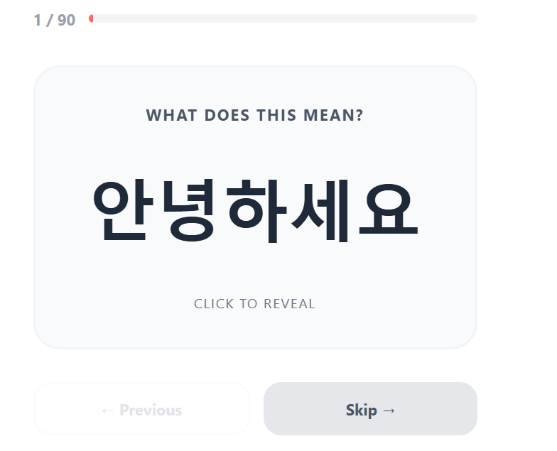
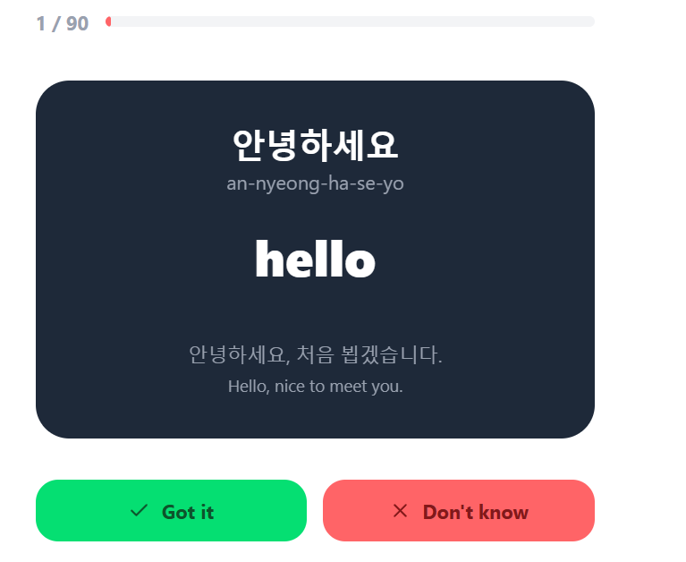

# 🐱 Korean Learning Web App

A beginner-friendly Korean vocabulary app built with React and TypeScript.  
Designed to help learners discover Hangul and everyday words through interactive flashcards and quizzes.

> Built as a personal project to learn React while actually learning Korean 🇰🇷

## 📸 Preview




## ✨ Features

### Currently available

- **Flashcards** — flip animation, Got it / Don't know rating, session score
- **TOPIK 1 vocabulary** — initial dataset (20 words)
- **Session summary** — simple progress tracking at the end of each session

### In progress

- **Quiz** — multiple choice questions based on the vocabulary
- **Progress tracking** — better visibility on known vs unknown words, Zustand

### Planned

- **Hangul** — learn the Korean alphabet with pronunciation
- **Numbers** — native and sino-Korean systems
- **Search** — look up words from the dataset
- **Dark mode**

## 🛠️ Tech Stack

- **React + TypeScript** — UI library with static typing
- **Vite** — build tool
- **Tailwind CSS** — utility-first styling
- **Framer Motion** — animations
- **Zustand** — state management _(coming)_
- **React Router** — routing _(coming)_

## 📁 Project structure

```
src/
├── app/ # App entry and routing
├── components/ # Shared UI components
├── data/ # Static dataset (vocabulary, etc.)
├── features/ # Feature-based modules
│ ├── flashcards/
│ ├── quiz/
│ └── vocabulary/
├── hooks/ # Custom React hooks
├── lib/ # Pure utility functions
├── store/ # Global state (Zustand)
└── types/ # TypeScript types
```

## 🧠 Architecture decisions

**Feature-based structure** — Each feature is self-contained, making the app easier to scale and maintain.

**Local dataset first** — Vocabulary is stored in JSON for simplicity and fast loading.

**Separation of concerns** — UI, state, and logic are clearly separated to keep the codebase readable.

## 🇰🇷 About the project

Nabi (나비) means butterfly in Korean — and also happens to be a traditional Korean cat name 🐱

This project was built to learn React by building a real product, step by step, with a focus on understanding core concepts rather than copying tutorials.

## 🚀 Getting started

### Prerequisites

Make sure you have Node.js installed on your machine. You can download it at **nodejs.org** — download the LTS version.

Check your installation:

```bash
node -v
npm -v
```

### Installation

1. Clone the repository

```bash
git clone https://github.com/AlizeePe/nabi.git
```

2. Navigate to the project folder

```bash
cd nabi
```

3. Install dependencies

```bash
npm install
```

4. Start the development server

```bash
npm run dev
```

5. Open your browser at http://localhost:5173

---

## 📝 Available Scripts

```bash
npm run dev      # Start development server
npm run build    # Build for production
npm run preview  # Preview production build
```

## 📬 Contact

Alizée Perrichon — [linkedin.com/in/alizee-perrichon](https://linkedin.com/in/alizee-perrichon)

Made with 🐱 by Alizee
